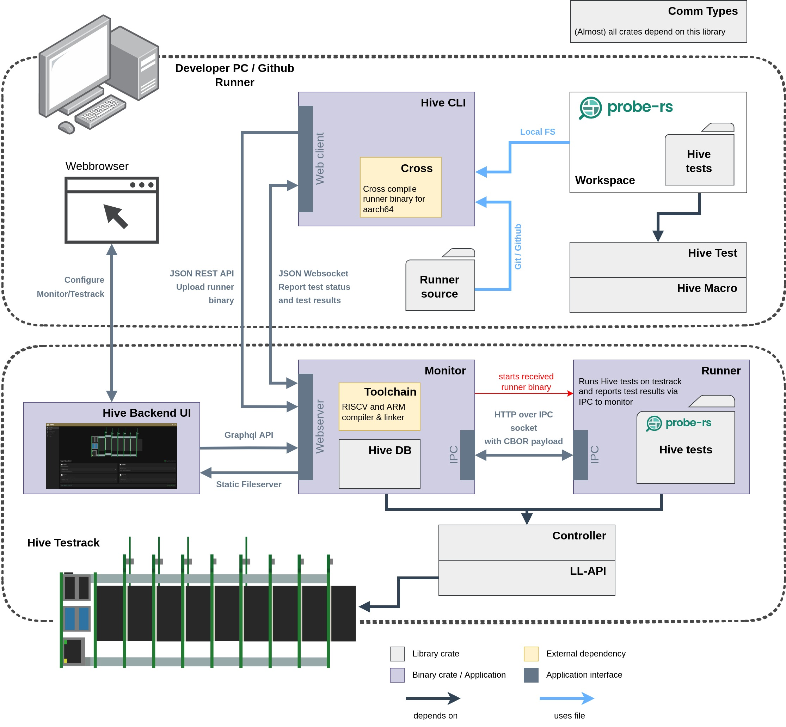

# Hive Software
This repository contains all the software used for Hive. The Hive hardware can be found [here](https://github.com/probe-rs/hive). 

## Workspace
| Crate | Contents |
| --- | --- |
| [comm-types](./comm-types/) | Contains all types which are used for communication by various other crates in the workspace |
| [controller](./controller/) | Contains common functionality used by the runner and monitor. Mainly a hardware abstraction on top of the ll-api as well as logging functionality |
| [hive](./hive/) | The Hive CLI used to issue test requests to the Hive testserver |
| [hive-backend-ui](./hive-backend-ui/) | The Hive testserver backend user interface, used to do most of the testserver configuration |
| [hive-db](./hive-db/) | A sled based DB used by the monitor and runner |
| [hive-macro](./hive-macro/) | Macros used by Hive applications. Currently contains the testfunction macros used to write Hive tests |
| [hive-test](./hive-test/) | A lib crate which contains and reexports types that are required for writing Hive tests |
| [ll-api](./ll-api/) | The low level Hive hardware abstraction crate |
| [monitor](./monitor/) | The heart of Hive as it runs the testserver and contains all related functionality |
| [runner](./runner/) | The runner is a binary which is built by the Hive CLI based on the Hive tests written by the user. It is then used by the monitor to run the tests on the hardware |

For more information on each crate, you can visit the respective readme's in the crate folders.

## Overview
For a general overview on how this all plays together, please have a look at the graphic below:



For further info please visit the [wiki](https://github.com/probe-rs/hive-software/wiki)

## Development
In order to be able to build the runner crate you need to additionally clone the probe-rs repo into a directory named `probe-rs-hive-testcandidate` adjacent to the top-level directory of this repo.
Then make sure that the probe-rs-hive-testcandidate is at the same version as the probe-rs dependency of hive-software:
```
git clone https://github.com/probe-rs/hive-software.git
```
Then clone probe-rs and checkout the appropriate version tag
```
git clone https://github.com/probe-rs/probe-rs.git probe-rs-hive-testcandidate --branch v0.18.0
```